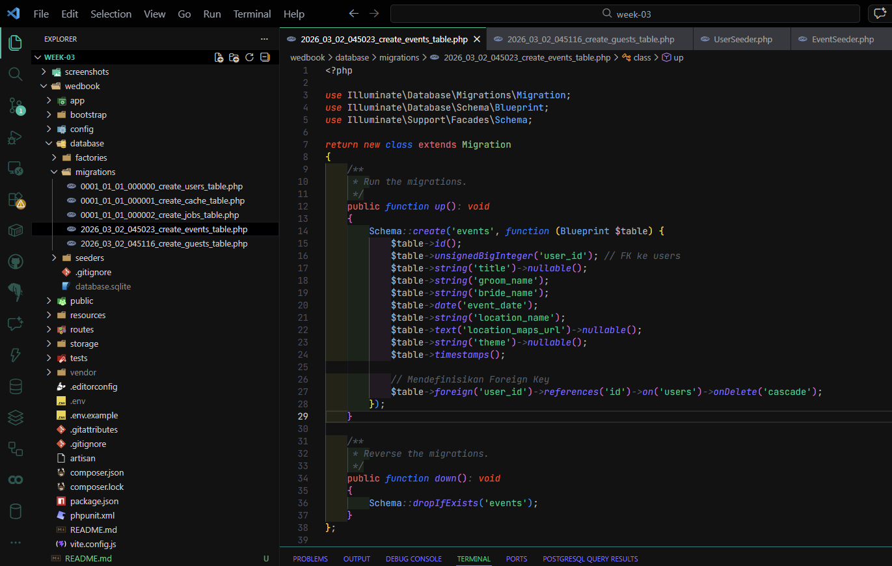
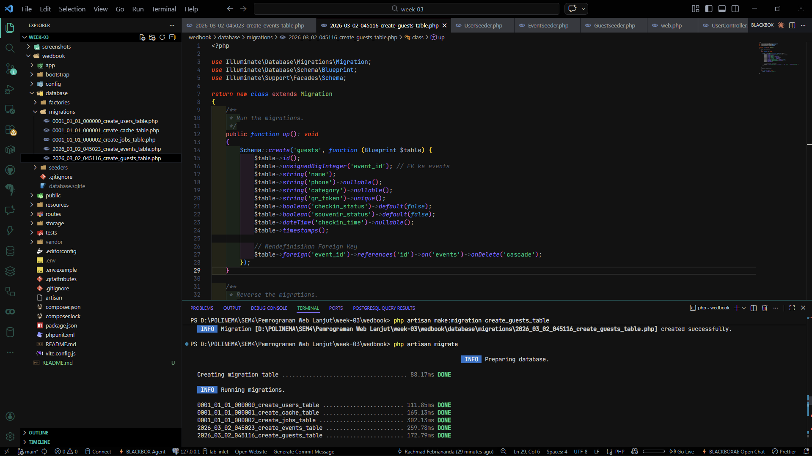
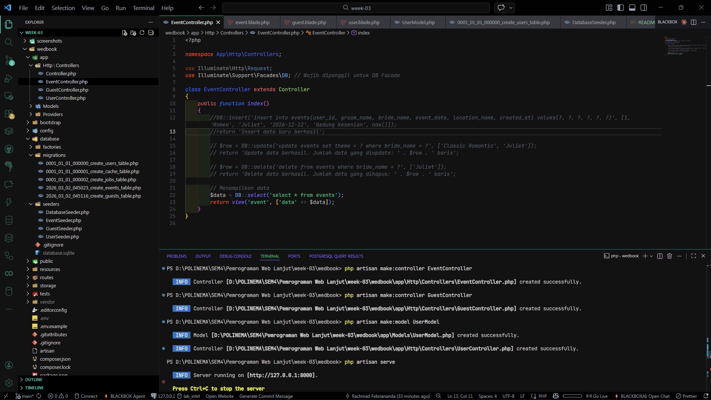
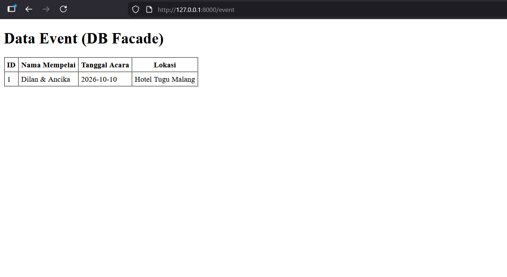
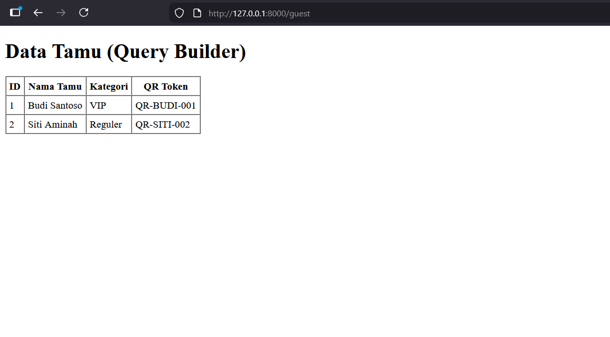
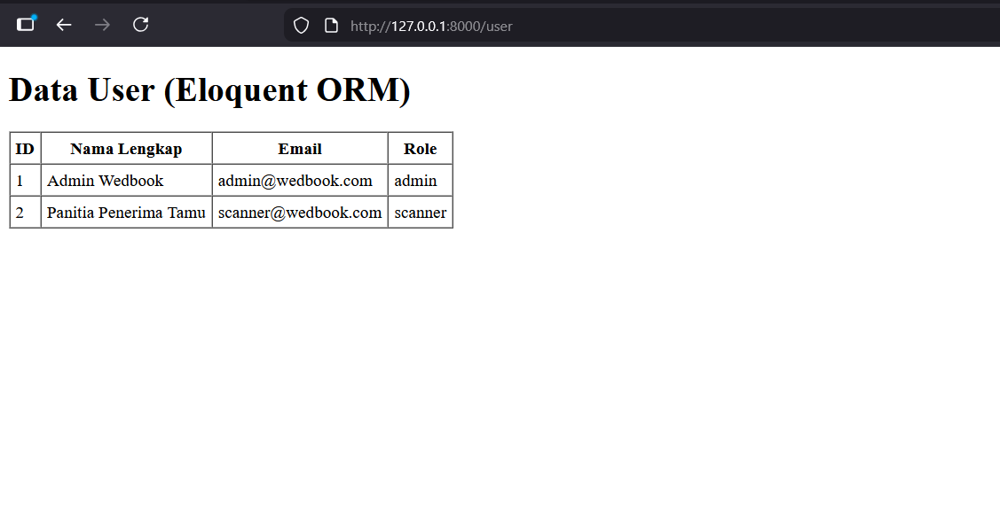

# Laporan Praktikum Pemrograman Web Lanjut - Jobsheet 3

**Topik:** Migration, Seeder, DB Façade, Query Builder, dan Eloquent ORM

**Nama:** Rachmad Febriananda
**NIM:** 244107020095
**Kelas:** TI-2F

**Jobsheet** Migration, Seeder, DB Façade, Query Builder, dan Eloquent ORM

---

**Studi Kasus:** Wedbook (Sistem Manajemen Tamu Digital)

## Praktikum 1: Pengaturan Database

Berhasil membuat database `wedbook` di phpMyAdmin dan mengonfigurasi koneksinya pada file `.env` Laravel.

## Praktikum 2.1: Pembuatan File Migrasi Tanpa Relasi

Melakukan pembuatan file migrasi dasar untuk tabel `users` yang berdiri sendiri (tidak memiliki foreign key).

## Praktikum 2.2: Pembuatan File Migrasi Dengan Relasi

Membuat rancangan tabel yang memiliki relasi (foreign key) yaitu tabel `events` dan `guests`, kemudian mengeksekusinya ke database menggunakan perintah migrate.

## Praktikum 3: Seeder

Melakukan pengisian data awal (_dummy data_) secara otomatis ke dalam database menggunakan Seeder untuk tabel `users`, `events`, dan `guests`.

## Praktikum 4: Implementasi DB Facade

Menerapkan operasi database menggunakan metode **DB Facade (Raw Query)** untuk mengeksekusi sintaks SQL murni dalam menampilkan data _Event_.

## Praktikum 5: Implementasi Query Builder

Menerapkan operasi database menggunakan fitur **Query Builder** bawaan Laravel yang lebih rapi untuk menampilkan daftar Tamu Undangan (_Guests_).

## Praktikum 6: Implementasi Eloquent ORM

Menerapkan pendekatan _Object-Relational Mapping_ (**Eloquent ORM**) dengan membuat Model khusus untuk mengambil dan menampilkan data Pengguna (_Users_) secara _object-oriented_.

---

_Laporan ini disusun untuk memenuhi tugas mata kuliah Pemrograman Web Lanjut._
