# Laporan Praktikum Pemrograman Web Lanjut - Jobsheet 3

**Topik:** Migration, Seeder, DB Façade, Query Builder, dan Eloquent ORM

**Nama:** Rachmad Febriananda  
**NIM:** 244107020095  
**Kelas:** TI-2F

**Link Repository Project Jobsheet 3:** https://github.com/rachmadnanda/Pemrograman-Web-Lanjut/tree/main/week-02/POS  
**Link Repository Project Studi Kasus:** https://github.com/rachmadnanda/Pemrograman-Web-Lanjut/tree/main/week-03/wedbook  
**Untuk laporan Jobsheet 3 dan Studi Kasus semuanya menjadi satu di dalam file README week-03 ini.**

---

## **Laporan Jobsheet 3:** Migration, Seeder, DB Façade, Query Builder, dan Eloquent ORM

## Praktikum 1: Pengaturan Database

Berhasil membuat database dan mengonfigurasi koneksinya pada file `.env` Laravel.
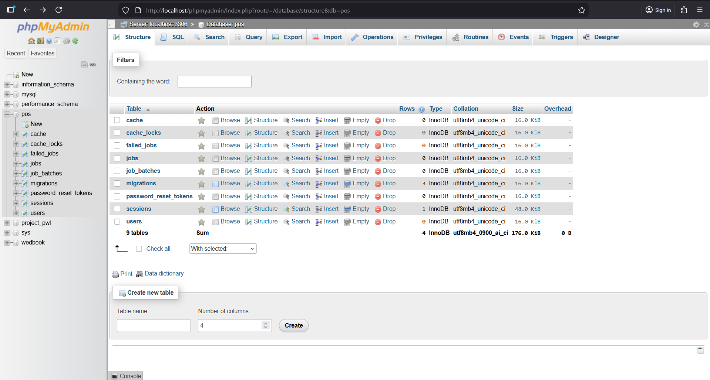
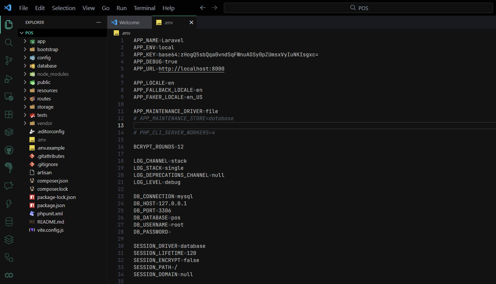

## Praktikum 2: Pembuatan File Migrasi

Melakukan pembuatan file migrasi untuk tabel database dan mengeksekusinya menggunakan perintah migrate.
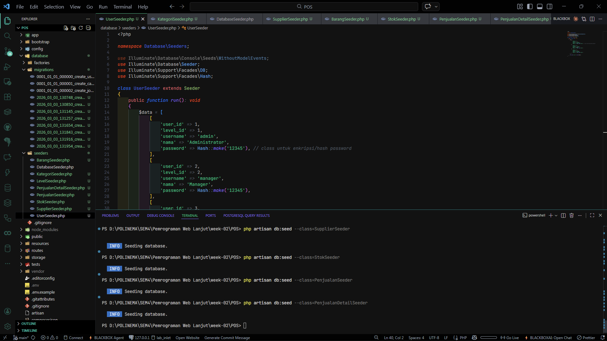
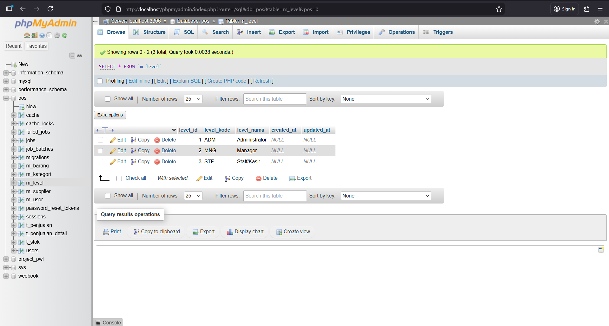

## Praktikum 3: Seeder

Melakukan pengisian data awal (_dummy data_) secara otomatis ke dalam database menggunakan Seeder.

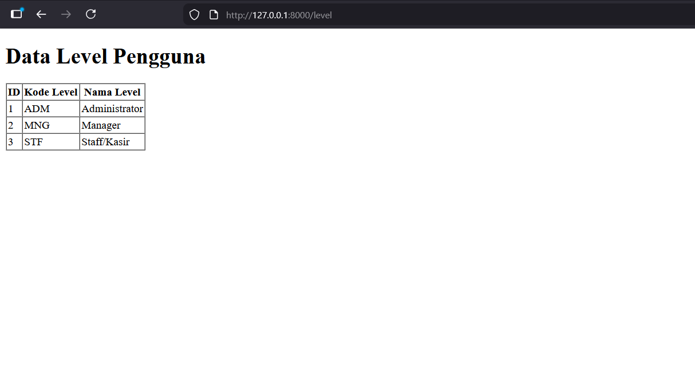

## Praktikum 4: Implementasi DB Facade

Menerapkan operasi database menggunakan metode **DB Facade (Raw Query)** untuk mengeksekusi sintaks SQL murni.
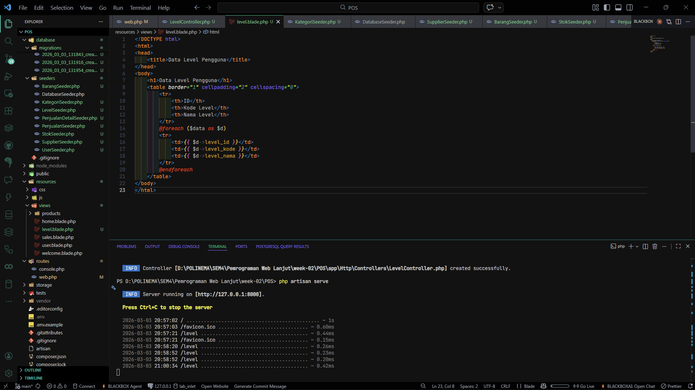
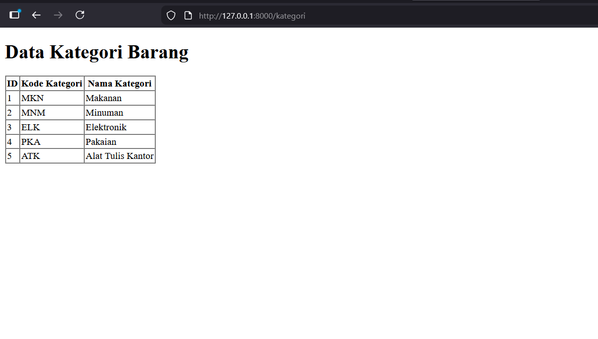

## Praktikum 5: Implementasi Query Builder

Menerapkan operasi database menggunakan fitur **Query Builder** bawaan Laravel yang lebih rapi untuk menampilkan data.
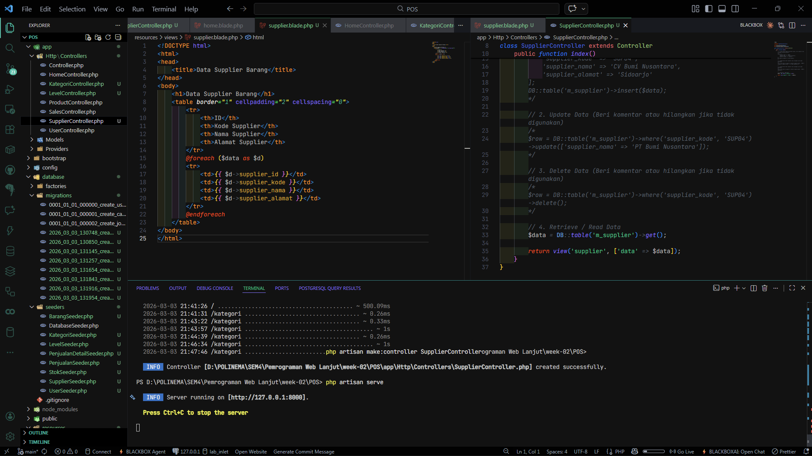
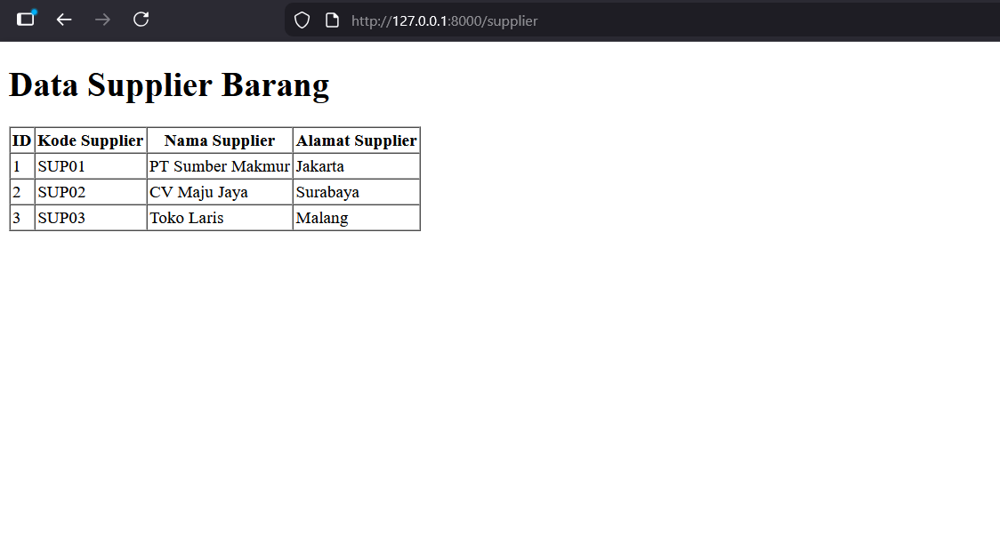

## Praktikum 6: Implementasi Eloquent ORM

Menerapkan pendekatan _Object-Relational Mapping_ (**Eloquent ORM**) dengan membuat Model khusus untuk mengambil dan menampilkan data secara _object-oriented_.
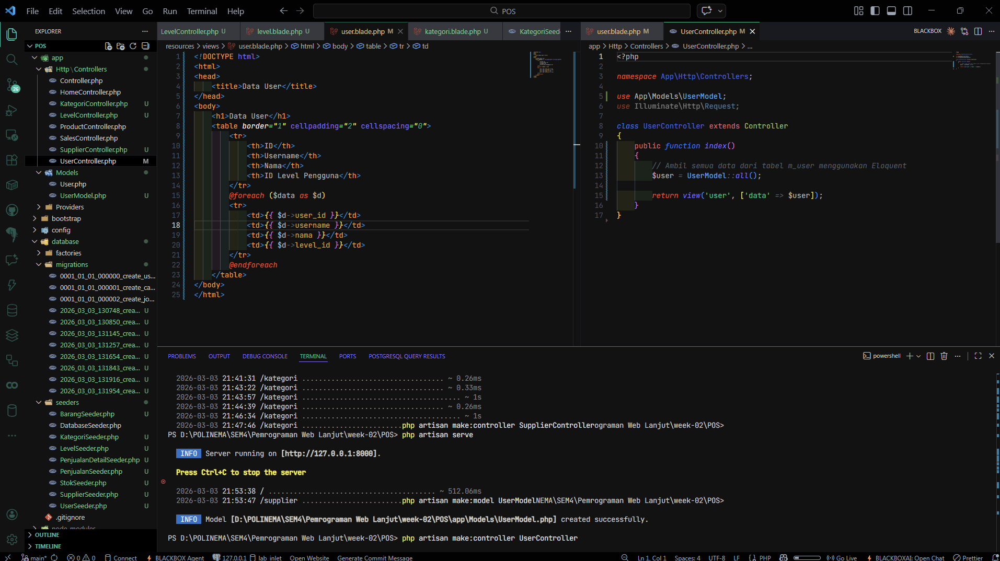
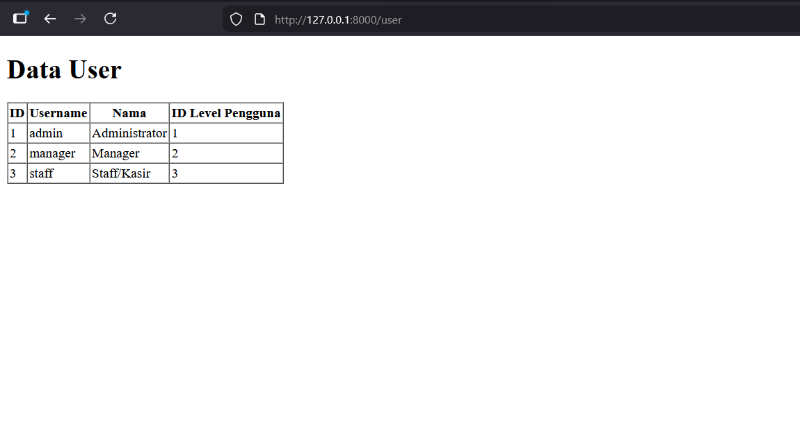
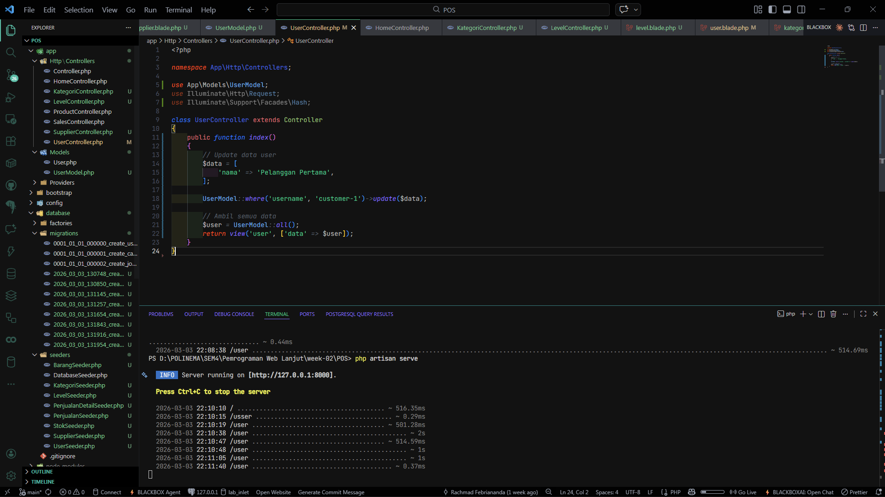
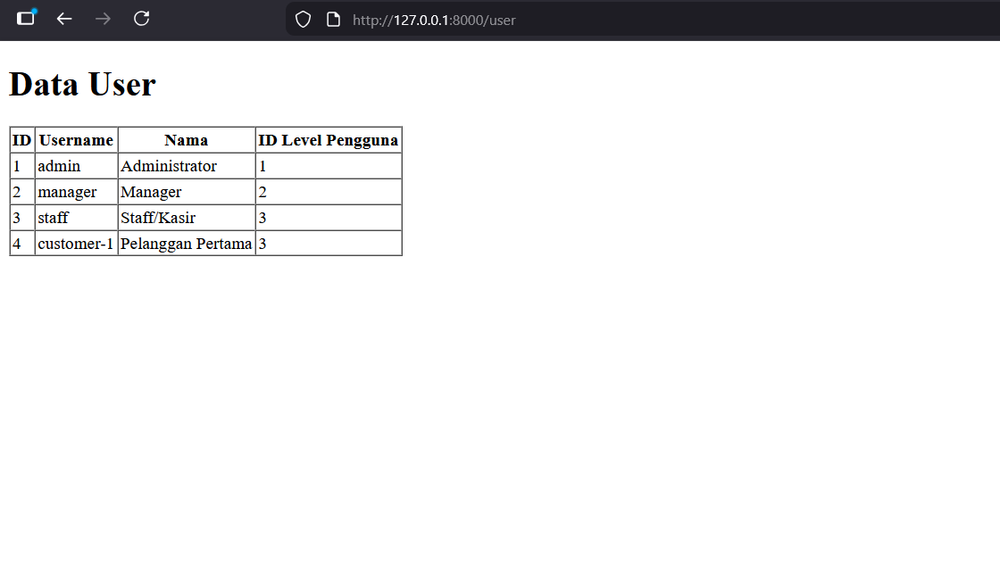

## Pertanyaan Penutup

1. **Pada Praktikum 1 - Tahap 5, apakah fungsi dari APP_KEY pada file setting .env Laravel?**

   APP_KEY pada file .env Laravel berfungsi sebagai kunci rahasia (secret key) yang digunakan oleh Laravel untuk berbagai operasi enkripsi dan dekripsi dalam aplikasi, seperti enkripsi cookie, data session, dan password. Ini memastikan keamanan data aplikasi agar tidak mudah dibaca atau direkayasa oleh pihak luar.

2. **Pada Praktikum 1, bagaimana kita men-generate nilai untuk APP_KEY?**

   Nilai untuk APP_KEY digenerate menggunakan perintah Artisan di terminal: `php artisan key:generate`.

3. **Pada Praktikum 2.1 - Tahap 1, secara default Laravel memiliki berapa file migrasi? dan untuk apa saja file migrasi tersebut?**

   Secara default, Laravel memiliki 4 file migrasi (seperti yang terlihat pada kotak merah di gambar Praktikum 2.1):
   - `_create_users_table.php`: Untuk membuat tabel users (penyimpanan data pengguna/autentikasi).
   - `_create_password_reset_tokens_table.php`: Untuk tabel penyimpanan token saat pengguna melakukan reset password.
   - `_create_failed_jobs_table.php`: Untuk tabel penyimpanan catatan proses job/queue yang gagal (failed jobs).
   - `_create_personal_access_tokens_table.php`: Untuk tabel pembuatan token autentikasi API (Personal Access Tokens).

4. **Secara default, file migrasi terdapat kode `$table->timestamps();`, apa tujuan/output dari fungsi tersebut?**

   Fungsi `$table->timestamps();` akan secara otomatis membuat dua kolom bertipe timestamp pada tabel tersebut, yaitu `created_at` (mencatat waktu saat data dibuat) dan `updated_at` (mencatat waktu saat data terakhir diubah).

5. **Pada File Migrasi, terdapat fungsi `$table->id();` Tipe data apa yang dihasilkan dari fungsi tersebut?**

   Fungsi `$table->id();` menghasilkan kolom dengan tipe data Unsigned Big Integer (BigInt) yang secara otomatis diset sebagai Primary Key dan bersifat Auto Increment.

6. **Apa bedanya hasil migrasi pada table m_level, antara menggunakan `$table->id();` dengan menggunakan `$table->id('level_id');`?**
   - `$table->id();`: Akan membuat kolom Primary Key dengan nama default `id`.
   - `$table->id('level_id');`: Akan membuat kolom Primary Key dengan nama `level_id`.

7. **Pada migration, Fungsi `->unique()` digunakan untuk apa?**

   Fungsi `->unique()` (Unique Constraint) digunakan untuk memastikan bahwa tidak ada nilai yang sama (duplikat) di dalam kolom tersebut. Setiap baris data dalam kolom itu harus unik (misalnya, untuk kolom username atau kode tertentu).

8. **Pada Praktikum 2.2 Tahap 2, kenapa kolom level_id pada tabel m_user menggunakan `$table->unsignedBigInteger('level_id')`, sedangkan kolom level_id pada tabel m_level menggunakan `$table->id('level_id')`?**
   - Pada `m_level`, `$table->id('level_id')` digunakan karena `level_id` adalah Primary Key. Fungsi `id()` sudah mencakup tipe `unsignedBigInteger` beserta pengaturan auto-increment dan menjadikannya Primary Key.
   - Pada `m_user`, `level_id` bertindak sebagai Foreign Key yang merujuk ke tabel `m_level`. Syarat agar Foreign Key dapat berelasi adalah tipe datanya harus persis sama dengan Primary Key yang dirujuk. Oleh karena itu, kita menggunakan `$table->unsignedBigInteger('level_id')` tanpa `id()` (agar tidak menjadi Primary Key/Auto Increment di `m_user`, tetapi tipe datanya matching dengan Primary Key di `m_level`).

9. **Pada Praktikum 3 - Tahap 6, apa tujuan dari Class Hash? dan apa maksud dari kode program `Hash::make('1234');`?**

   Tujuan dari Class Hash adalah untuk melakukan hashing (enkripsi satu arah) pada data sensitif, seperti kata sandi (password), sehingga password tidak disimpan dalam bentuk plaintext (teks asli) di database.

   Kode program `Hash::make('1234');` bermaksud untuk mengenkripsi kata sandi "1234" menggunakan algoritma hashing bawaan Laravel (biasanya Bcrypt). Hasil dari eksekusi ini adalah string acak yang aman untuk disimpan ke dalam database (seperti yang terlihat di screenshot database).

10. **Pada Praktikum 4 - Tahap 3/5/7, pada query builder terdapat tanda tanya (?), apa kegunaan dari tanda tanya (?) tersebut?**

    Tanda tanya (?) pada DB Facade (raw query) berfungsi sebagai parameter binding (atau placeholder). Ini digunakan untuk menyisipkan nilai (value) secara aman ke dalam kueri SQL. Tanda tanya tersebut akan digantikan oleh nilai yang berada di dalam array pada parameter kedua dari method kueri tersebut secara berurutan. Ini adalah cara standar untuk mencegah serangan SQL Injection.

11. **Pada Praktikum 6 Tahap 3, apa tujuan penulisan kode `protected $table = 'm_user';` dan `protected $primaryKey = 'user_id';`?**
    - `protected $table = 'm_user';` bertujuan untuk memberitahu model Eloquent (UserModel) secara spesifik bahwa ia terikat pada tabel bernama `m_user`. Jika tidak didefinisikan, Laravel akan berasumsi bahwa nama tabel adalah bentuk jamak dan berhuruf kecil dari nama kelas (yaitu `user_models`).
    - `protected $primaryKey = 'user_id';` bertujuan untuk memberitahu Eloquent bahwa kolom Primary Key dari tabel tersebut adalah `user_id`. Jika tidak didefinisikan, Eloquent akan berasumsi bahwa Primary Key selalu bernama `id`.

12. **Menurut kalian, lebih mudah menggunakan mana dalam melakukan operasi CRUD ke database (DB Façade / Query Builder / Eloquent ORM)? jelaskan.**

    **Eloquent ORM** adalah yang paling mudah dan direkomendasikan.

    **Penjelasan:** Eloquent ORM menggunakan konsep Object-Oriented, di mana setiap tabel direpresentasikan sebagai sebuah Model (objek). Kodenya jauh lebih singkat, sangat mudah dibaca (readable), dan fitur relasi antar tabelnya (seperti `hasMany`, `belongsTo`) sangat mempermudah pengambilan data yang kompleks dibandingkan harus menulis join query manual di Query Builder atau DB Facade. DB Facade berguna jika ada query SQL murni yang sangat kompleks, sedangkan Query Builder adalah alternatif jika performa kueri menjadi prioritas utama (karena ORM terkadang memakan lebih banyak memori), namun secara umum, tingkat kemudahan dan kecepatan development Eloquent ORM jauh lebih unggul.

---

## **Laporan Studi Kasus:** Wedbook (Sistem Manajemen Tamu Digital)

## Praktikum 1: Pengaturan Database

Berhasil membuat database `wedbook` di phpMyAdmin dan mengonfigurasi koneksinya pada file `.env` Laravel.

## Praktikum 2.1: Pembuatan File Migrasi Tanpa Relasi

Melakukan pembuatan file migrasi dasar untuk tabel `users` yang berdiri sendiri (tidak memiliki foreign key).

## Praktikum 2.2: Pembuatan File Migrasi Dengan Relasi

Membuat rancangan tabel yang memiliki relasi (foreign key) yaitu tabel `events` dan `guests`, kemudian mengeksekusinya ke database menggunakan perintah migrate.

## Praktikum 3: Seeder

Melakukan pengisian data awal (_dummy data_) secara otomatis ke dalam database menggunakan Seeder untuk tabel `users`, `events`, dan `guests`.

## Praktikum 4: Implementasi DB Facade

Menerapkan operasi database menggunakan metode **DB Facade (Raw Query)** untuk mengeksekusi sintaks SQL murni dalam menampilkan data _Event_.

## Praktikum 5: Implementasi Query Builder

Menerapkan operasi database menggunakan fitur **Query Builder** bawaan Laravel yang lebih rapi untuk menampilkan daftar Tamu Undangan (_Guests_).

## Praktikum 6: Implementasi Eloquent ORM

Menerapkan pendekatan _Object-Relational Mapping_ (**Eloquent ORM**) dengan membuat Model khusus untuk mengambil dan menampilkan data Pengguna (_Users_) secara _object-oriented_.

---

_Laporan ini disusun untuk memenuhi tugas mata kuliah Pemrograman Web Lanjut._
