# Laporan Praktikum Pemrograman Web Lanjut

**Topik:** Instalasi Filament PHP v4, CRUD Resource, dan Implementasi Relasi Database

## Deskripsi Proyek

Praktikum ini bertujuan untuk membangun sistem admin panel modern menggunakan Laravel 11 dan Filament PHP v4. Fokus utama meliputi proses instalasi, pembuatan fitur CRUD (Create, Read, Update, Delete) otomatis, serta pengelolaan relasi antar tabel database untuk entitas Kategori dan Postingan.

## Persiapan Lingkungan (Requirements)

Sebelum memulai, pastikan sistem memenuhi spesifikasi minimum berikut:

- PHP: $\geq$ 8.2
- Laravel: Version 11
- Tailwind CSS: $\geq$ 4.0
- Database: MySQL atau SQLite

## Langkah-Langkah Praktikum

### 1. Jobsheet 1: Instalasi dan Setup Dasar

Langkah awal adalah menyiapkan kerangka kerja Laravel dan mengintegrasikan Filament sebagai admin panel utama.

#### Instalasi Laravel

Membuat proyek baru dengan nama PraktikumPWL.

```bash
composer create-project laravel/laravel PraktikumPWL
cd PraktikumPWL
```

#### Konfigurasi Database

Mengatur file `.env` untuk menghubungkan aplikasi ke MySQL.

```
DB_CONNECTION=mysql
DB_DATABASE=Filament2026
DB_USERNAME=root
DB_PASSWORD=
```

#### Instalasi Filament

Menambahkan paket Filament v4 dan memasang Panel Builder.

```bash
composer require filament/filament:"^4.0" -W
php artisan filament:install --panels
```

#### Membuat User Admin

Membuat akun kredensial untuk masuk ke dashboard.

```bash
php artisan make:filament-user
# Name: Admin User
# Email: admin@gmail.com
# Password: (Sesuai input Anda)
```

#### Screenshot Jobsheet 1

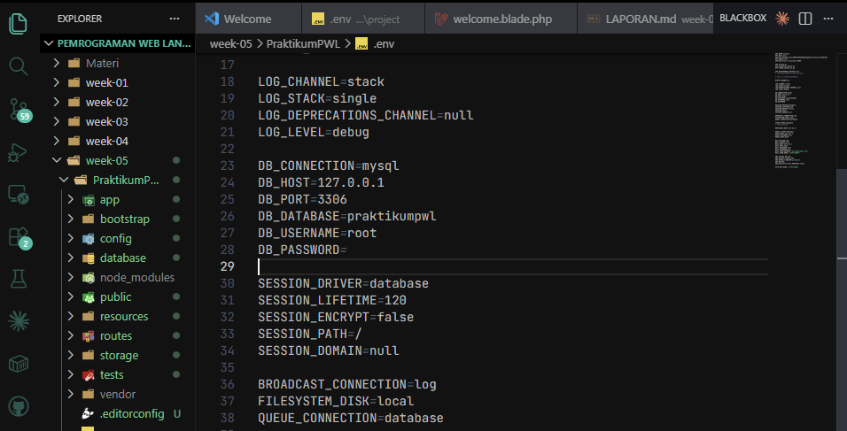

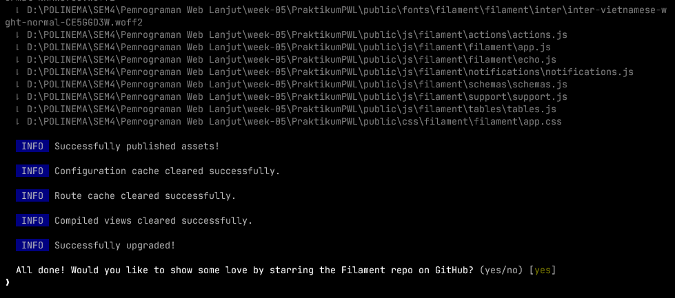

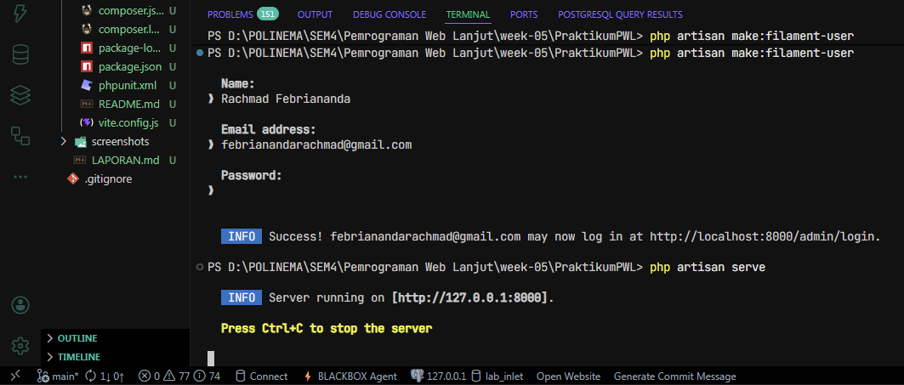

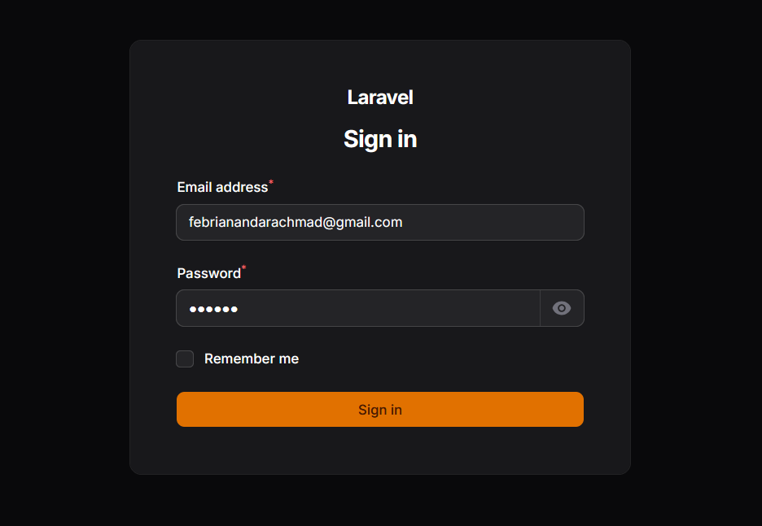

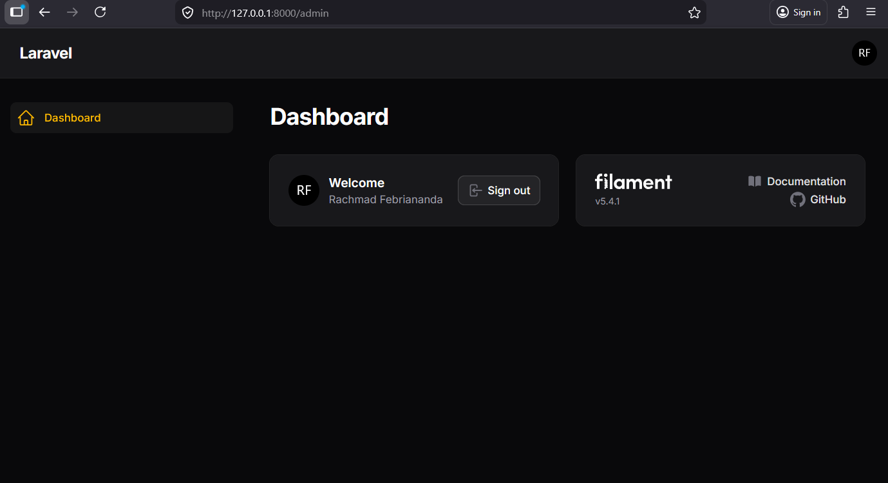

## Analisis dan Diskusi Materi

1. Kelebihan Filament vs Manual: Filament jauh lebih cepat karena kamu tidak perlu membuat UI dari nol. Fitur standar seperti tabel (CRUD), form, filter, dan autentikasi sudah tersedia secara out-of-the-box. Kamu cukup melakukan konfigurasi, bukan menulis kode UI yang berulang.
2. Mengapa Livewire: Filament memilih Livewire agar aplikasi terasa reaktif dan interaktif (seperti menggunakan React atau Vue) namun tetap ditulis sepenuhnya menggunakan PHP. Ini memudahkan developer Laravel karena tidak perlu berpindah-pindah bahasa ke JavaScript untuk membuat fitur yang dinamis.
3. SQLite vs MySQL (Development):
   SQLite: Berupa satu file tunggal di dalam folder proyek. Sangat praktis, tidak butuh instalasi server, dan cocok untuk tahap awal atau testing.
   MySQL: Memerlukan server database terpisah. Lebih bertenaga, mendukung banyak pengguna sekaligus, dan biasanya merupakan lingkungan yang paling mirip dengan kondisi production (server asli).
4. Fungsi Panel Builder: Ini adalah inti dari Filament yang berfungsi untuk membangun struktur admin panel secara utuh. Panel Builder mengatur navigasi, tema (warna/branding), autentikasi, serta mengelompokkan berbagai menu (Resource) ke dalam satu wadah yang konsisten.

### 2. Jobsheet 2: CRUD Resource User

Menggunakan fitur Resource Filament untuk mengelola data user secara otomatis tanpa menulis banyak kode manual.

#### Generate Resource

Perintah ini akan membuat file Resource utama, Pages, dan Schemas.

```bash
php artisan make:filament-resource User
```

#### Modifikasi Form Schema

Mengatur inputan pada file `UserForm.php`.

```php
// Lokasi: app/Filament/Admin/Resources/Users/Schemas/UserForm.php
public static function configure(Schema $schema): Schema {
    return $schema->components([
        TextInput::make('name')->required()->maxLength(255),
        TextInput::make('email')->email()->required()->maxLength(255),
        TextInput::make('password')->password()->required(),
    ]);
}
```

#### Modifikasi Table Schema

Menampilkan kolom data pada file `UsersTable.php`.

```php
// Lokasi: app/Filament/Admin/Resources/Users/Tables/UsersTable.php
public static function configure(Table $table): Table {
    return $table->columns([
        TextColumn::make('name')->searchable()->sortable(),
        TextColumn::make('email')->searchable()->sortable(),
    ]);
}
```

#### Kustomisasi Ikon

Mengubah ikon navigasi sidebar menggunakan Heroicons.

```php
protected static ?string $navigationIcon = 'heroicon-o-user-group';
```

#### Screenshot Jobsheet 2

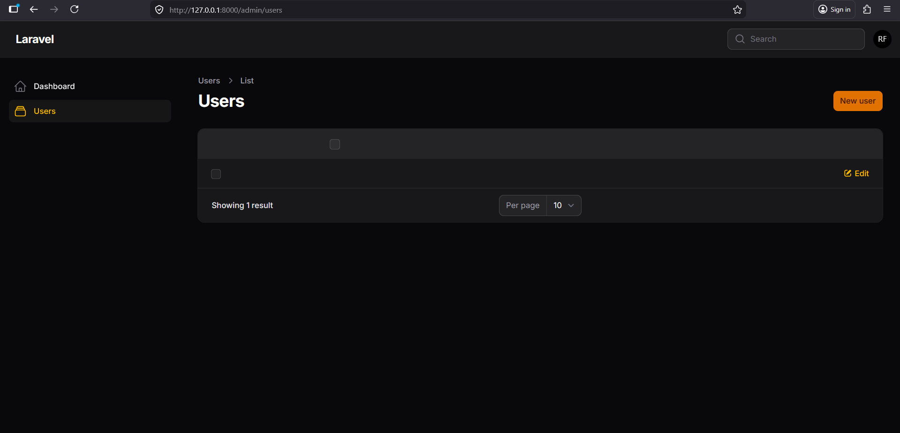

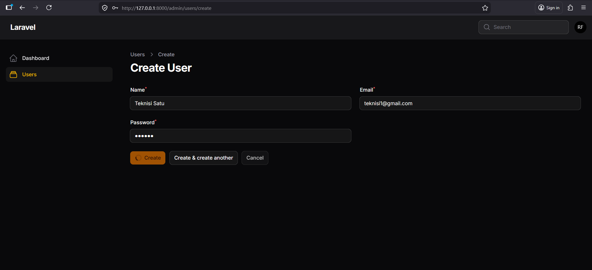

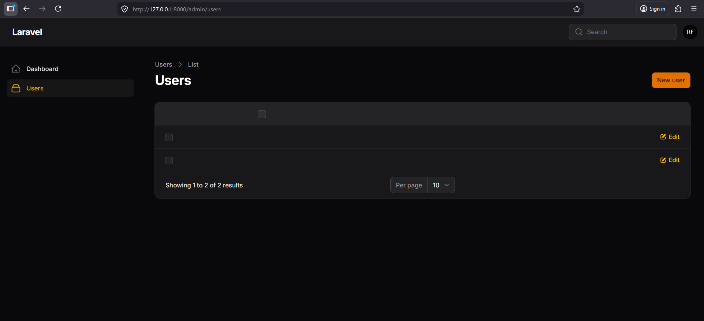

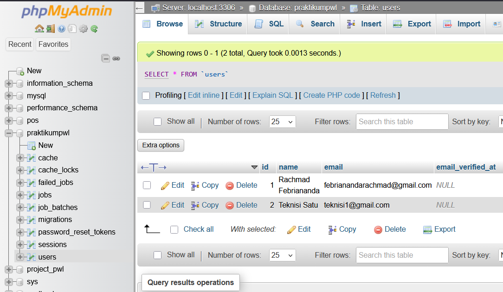

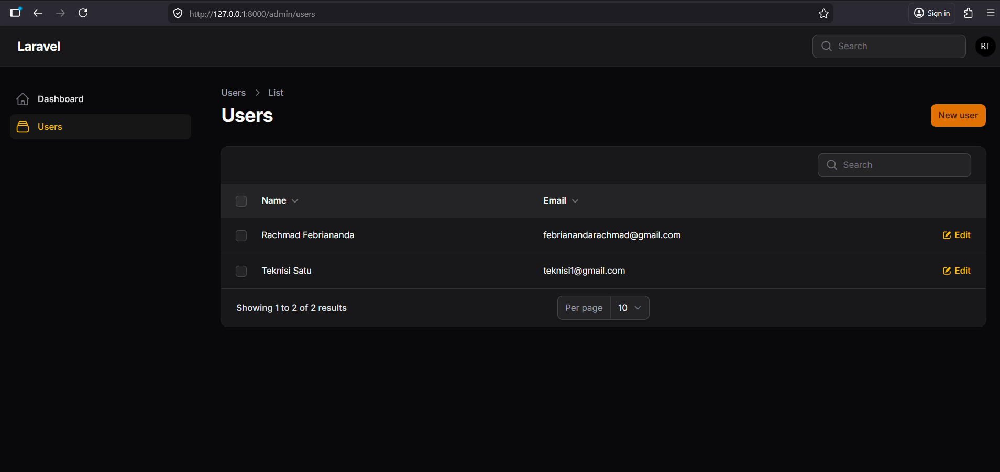

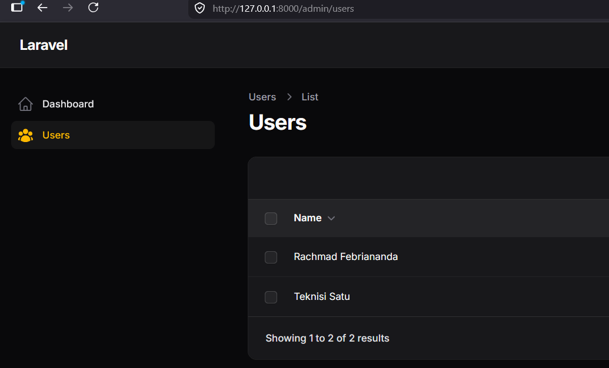

## Analisis dan Diskusi Materi

1. Mengapa Sedikit Coding: Filament menggunakan pendekatan deklaratif. Kamu cukup mendefinisikan schema (daftar kolom dan input) di dalam satu file Resource, lalu Filament secara otomatis membuatkan halaman List, Create, Edit, dan View lengkap dengan logika backend-nya.
2. Form vs Table Schema:
   Form Schema: Digunakan untuk bagian input data (tambah/edit). Berisi komponen seperti TextInput, Select, atau FileUpload.
   Table Schema: Digunakan untuk bagian tampil data (tabel). Berisi komponen seperti TextColumn, ImageColumn, serta pengaturan filter dan pencarian.
3. Validasi Email Unik: Kamu hanya perlu menambahkan method unique() pada komponen input email. Contohnya:

```php
Forms\Components\TextInput::make('email')
    ->email()
    ->required()
    ->unique(ignoreRecord: true) // ignoreRecord agar tidak error saat edit data sendiri
```

4. Otomatisasi Hash Password: Filament (dan Laravel secara sistem) sudah menangani enkripsi secara otomatis melalui fitur Attribute Casting pada Model atau melalui konfigurasi input password di Filament. Jadi, saat kamu menyimpan data, Laravel akan mendeteksi bahwa field tersebut adalah password dan melakukan hashing sebelum masuk ke database.

### 3. Jobsheet 3: Migration, Model, dan Relasi

Membangun struktur database yang lebih kompleks dengan relasi One-to-Many antara Kategori dan Postingan.

#### Migration Category & Post

Menentukan struktur tabel melalui file migrasi.

```php
// Migration Categories
Schema::create('categories', function (Blueprint $table) {
    $table->id();
    $table->string('name');
    $table->string('slug')->unique();
    $table->timestamps();
});

// Migration Posts (dengan Foreign Key)
Schema::create('posts', function (Blueprint $table) {
    $table->id();
    $table->foreignId('category_id')->constrained()->cascadeOnDelete();
    $table->string('title');
    $table->string('slug')->unique();
    $table->text('content');
    $table->boolean('is_published')->default(false);
    $table->timestamps();
});
```

#### Eloquent Relationship

Mendefinisikan relasi pada file `Model Post.php`.

```php
// Lokasi: app/Models/Post.php
protected $fillable = ['category_id', 'title', 'slug', 'content', 'is_published'];

public function category(): BelongsTo {
    return $this->belongsTo(Category::class);
}
```

#### Screenshot Jobsheet 3

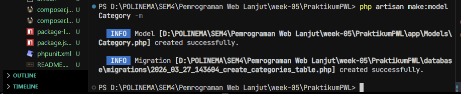

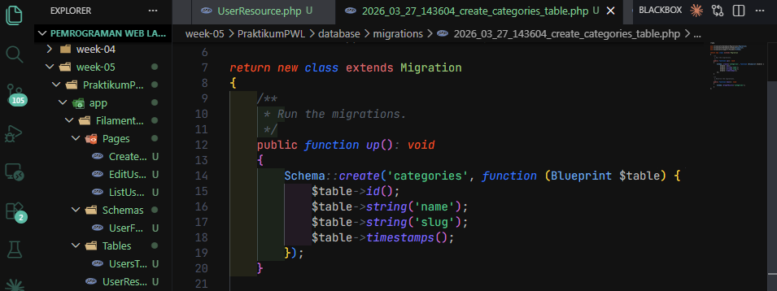

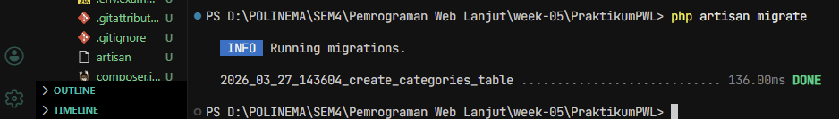

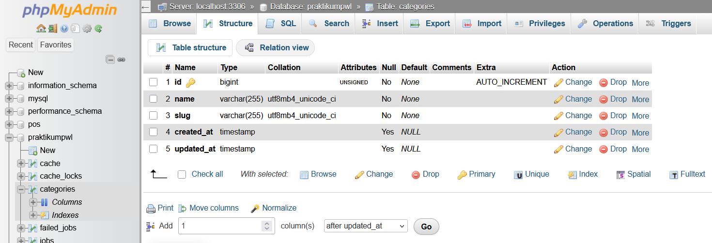

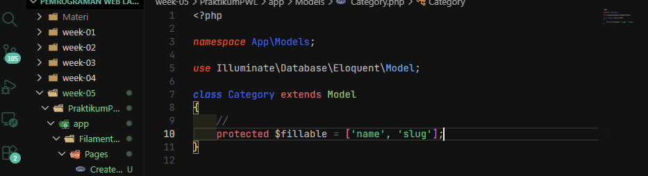

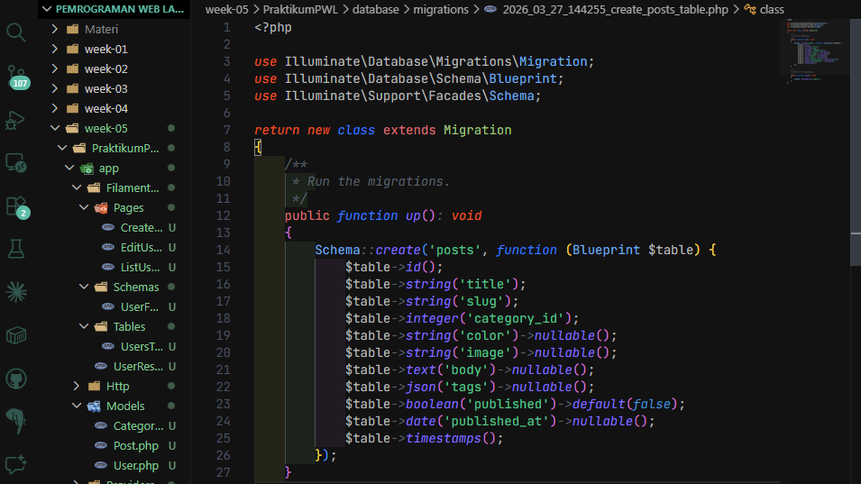

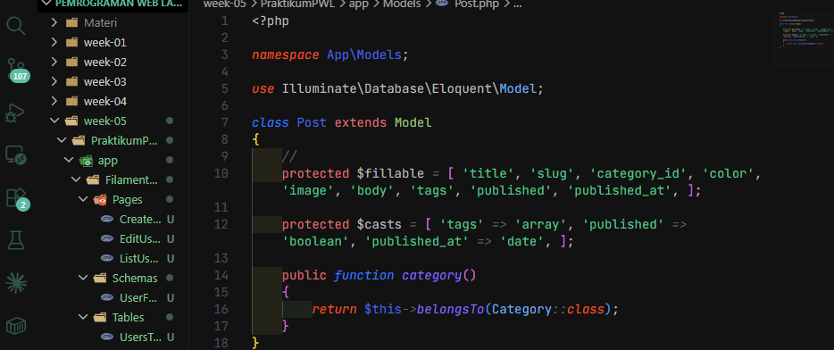

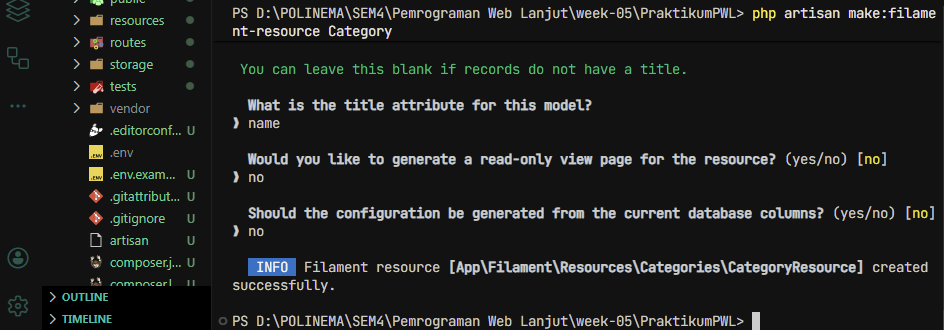

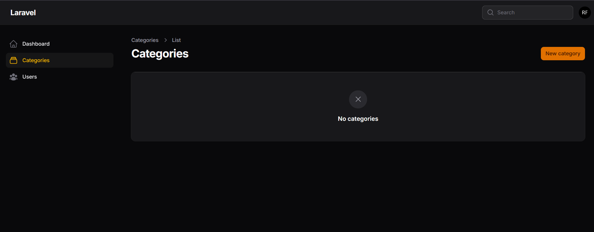

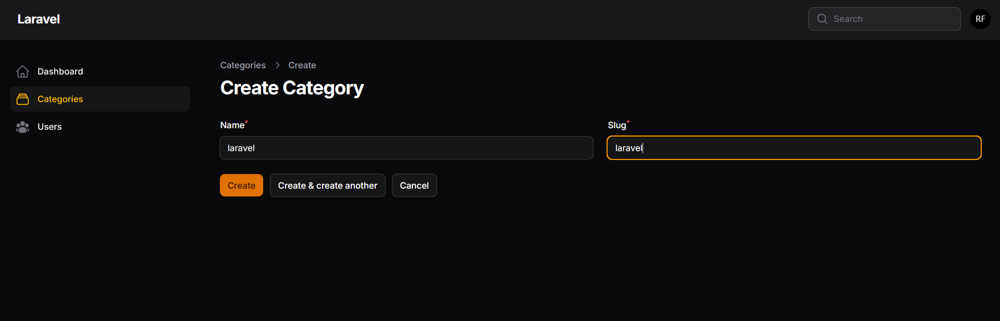

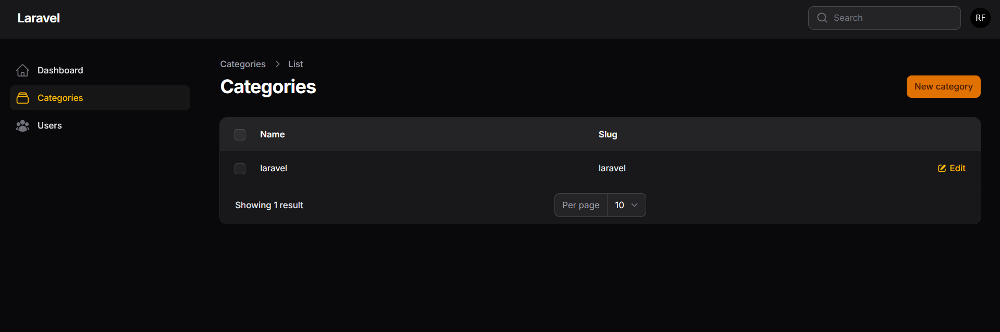

## Analisis & Diskusi Materi

1. Pentingnya $fillable: Ini adalah fitur Mass Assignment Protection. Fungsinya untuk menentukan kolom mana saja yang boleh diisi secara masal (misalnya lewat User::create($request->all())). Tanpa ini, hacker bisa mengirimkan data tambahan (seperti is_admin = true) lewat form dan mengubah data sensitif di database kamu.
2. Fungsi $casts: Digunakan untuk mengubah tipe data secara otomatis saat data keluar atau masuk ke database. Contohnya, kolom is_active yang di database bertipe integer (0/1) bisa otomatis menjadi boolean (true/false) di PHP, atau kolom JSON otomatis menjadi array.
3. Integer vs Foreign Key:
   Integer: Hanya tipe data angka biasa tanpa ada hubungan khusus dengan tabel lain.
   Foreign Key: Angka integer yang berfungsi sebagai penghubung (relasi) ke baris data di tabel lain. Ia memastikan integritas data (misal: post.category_id harus merujuk pada id yang benar-benar ada di tabel categories).
4. Kategori Dihapus tapi Ada Post: Ini bergantung pada pengaturan On Delete di database migration:
   Cascade: Semua post yang terkait ikut terhapus otomatis.
   Set Null: Kolom category_id pada post akan menjadi NULL (post tetap ada tanpa kategori).
   Restrict: Database akan menolak penghapusan kategori selama masih ada post yang menggunakannya (muncul error).

## Kesimpulan

Praktikum ini berhasil mengimplementasikan:

- Instalasi Laravel 11 dan Filament v4 dengan sukses.
- Konfigurasi database MySQL dan eksekusi migrasi tabel.
- Pembuatan User Admin dan Resource CRUD untuk entitas User.
- Pemahaman dasar mengenai Form Builder, Table Builder, dan sistem navigasi panel.
