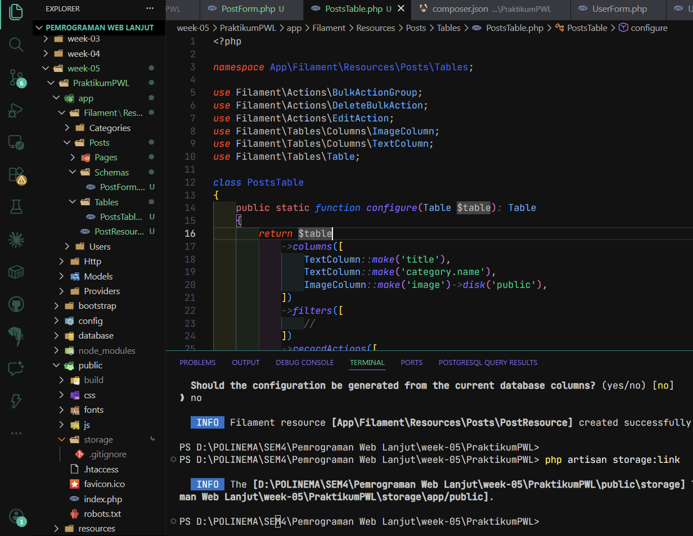
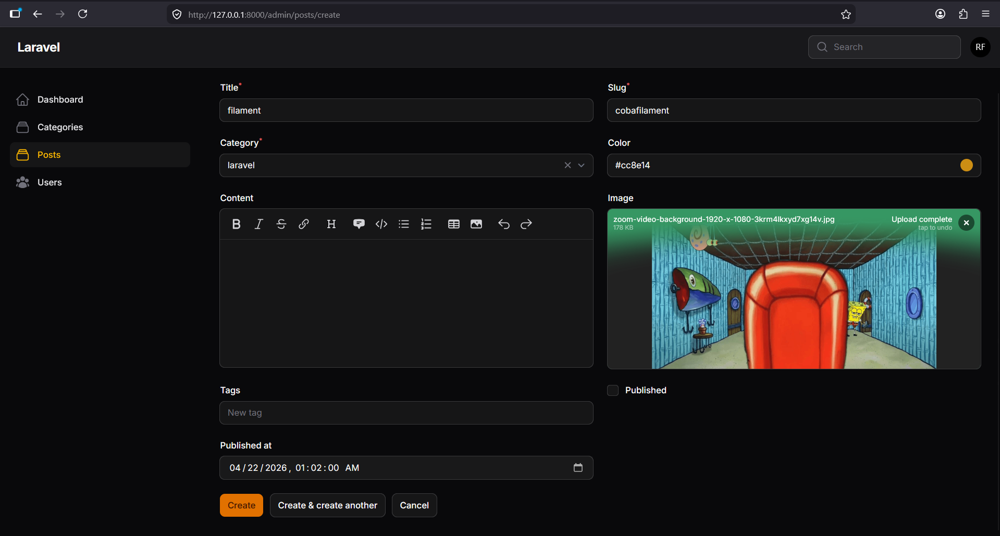
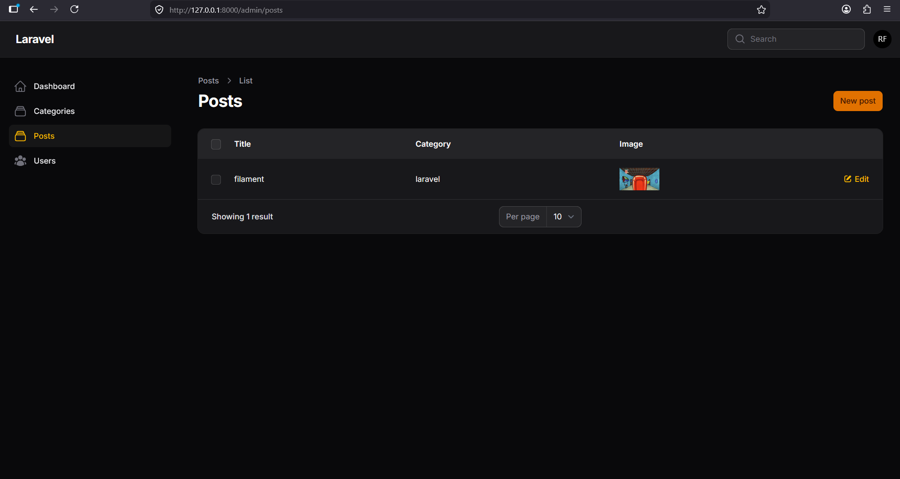
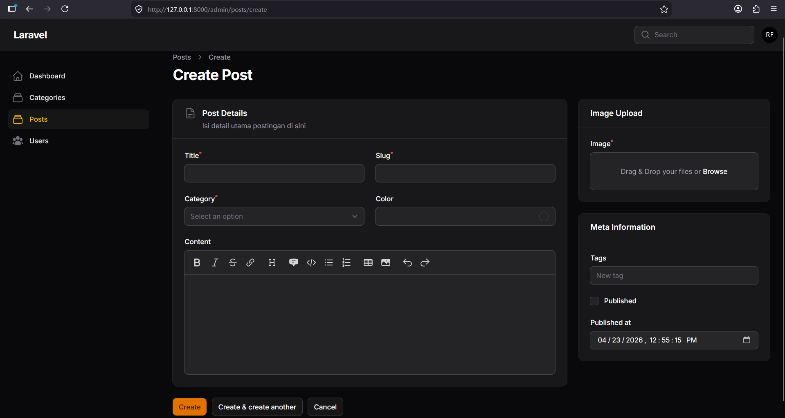
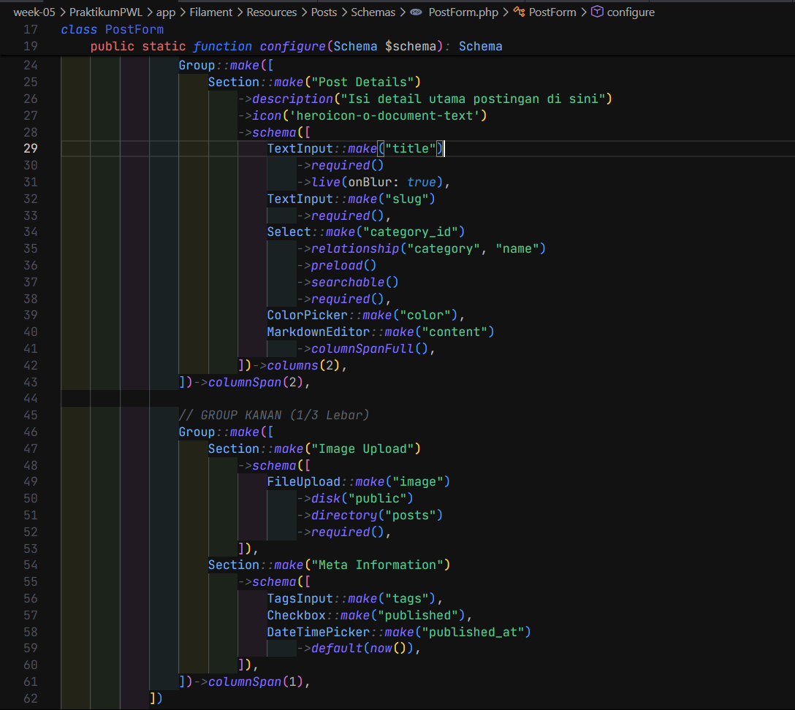
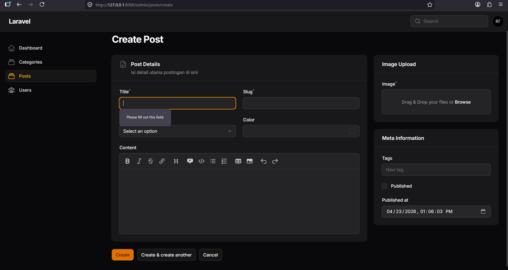
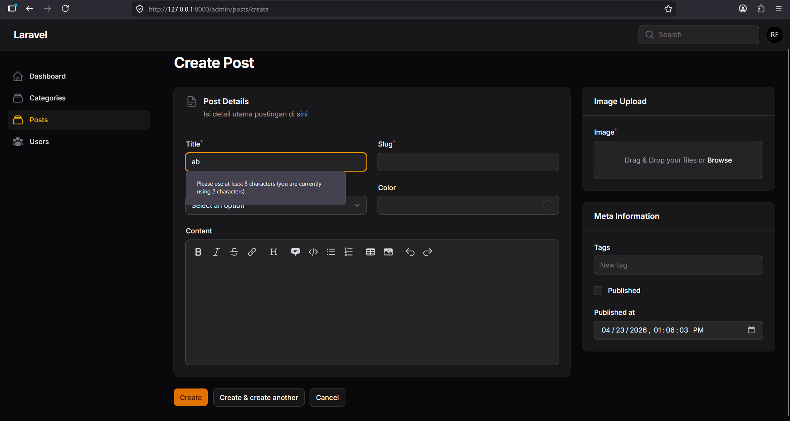
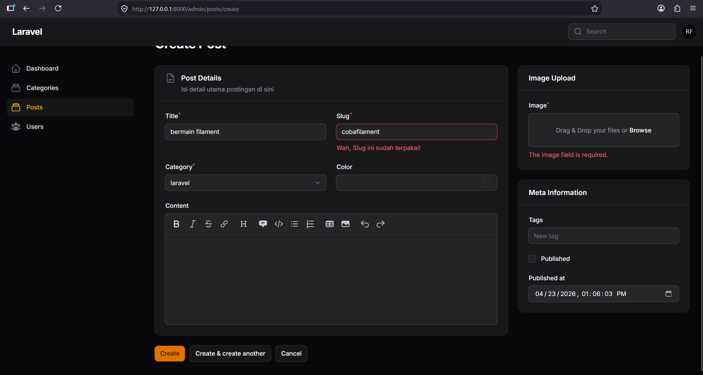

## **Nama: Rachmad Febriananda**

**NIM: 244107020095**  
**Kelas: TI-2F**

Link repository project yang dipakai (pertemuan sebelumnya): https://github.com/rachmadnanda/Pemrograman-Web-Lanjut/tree/main/week-05/PraktikumPWL

## **Laporan Praktikum: Jobsheet 1**

### **Implementasi Form Elements & Resource Post di Filament**

### **1\. Langkah-langkah Penting**

Berikut adalah rangkuman langkah-langkah krusial dalam pembuatan Resource Post:

- **Pembuatan Resource**: Menjalankan perintah php artisan make:filament-resource Post dengan konfigurasi _title attribute_ menggunakan kolom title, serta memilih "No" untuk opsi _read-only page_ dan _generate dari database_.
- **Konfigurasi Form (PostForm.php)**:
  - **Input Teks**: Menggunakan TextInput untuk field title dan slug.
  - **Relasi Kategori**: Menggunakan Select::make('category_id') dengan metode relationship('category', 'name') untuk menghubungkan Post dengan tabel Categories secara otomatis.
  - **Editor Konten**: Menggunakan MarkdownEditor atau RichEditor untuk memproses input body/konten yang mendukung format teks.
  - **Upload File**: Menggunakan FileUpload yang diarahkan ke disk public dan direktori posts.
  - **Input Lainnya**: Menambahkan ColorPicker untuk warna, TagsInput untuk tag (JSON), Checkbox untuk status publish, dan DateTimePicker untuk waktu publikasi.
- **Pengaturan Storage**: Menjalankan perintah php artisan storage:link agar file gambar yang diupload dapat diakses oleh browser melalui folder public.
- **Konfigurasi Tabel (PostsTable.php)**: Menambahkan kolom-kolom seperti TextColumn, ColorColumn, dan ImageColumn agar data yang telah diinput dapat tampil di halaman indeks.

### **2\. Hasil Analisis**

- **Otomasi UI**: Filament mempermudah pembuatan antarmuka admin hanya dengan mendefinisikan skema di file Resource tanpa perlu membuat View manual.
- **Penanganan Relasi**: Penggunaan method relationship() pada komponen Select sangat efisien karena Filament secara otomatis mengambil data dari model relasi dan menangani penyimpanan _Foreign Key_.
- **Penyimpanan Media**: Upload gambar memerlukan sinkronisasi antara folder storage internal Laravel dan folder public melalui _symbolic link_ agar dapat dirender di tabel.
- **Casting Data**: Field seperti tags yang bertipe JSON harus dipastikan sudah di-_cast_ menjadi array di dalam Model Post agar komponen TagsInput berfungsi dengan benar.

### **3\.**

Jawaban Pertanyaan Analisis & Diskusi

1. **Mengapa kita perlu storage:link?** Secara default, Laravel menyimpan file unggahan di folder storage/app/public yang tidak dapat diakses langsung secara publik demi keamanan. storage:link membuat "jalan pintas" (symbolic link) dari folder public/storage ke folder tersebut agar gambar bisa ditampilkan di browser.
2. **Apa fungsi $casts untuk field JSON?** Fungsi $casts pada model bertujuan untuk mengubah format data saat masuk atau keluar dari database. Untuk field JSON (seperti tags), casting ke array memberitahu Laravel untuk memperlakukan string JSON tersebut sebagai array PHP biasa sehingga bisa dimanipulasi oleh komponen TagsInput.
3. **Mengapa kita menggunakan category.name bukan category_id pada tabel?** Menggunakan category.name (dot notation) memungkinkan Filament untuk menampilkan nama kategori yang manusiawi (human-readable) dari tabel relasi, bukan sekadar angka ID yang sulit dipahami oleh admin.
4. **Apa perbedaan RichEditor dan MarkdownEditor?** RichEditor menghasilkan output berupa format HTML (WYSIWYG), sedangkan MarkdownEditor menggunakan sintaks Markdown teks biasa yang kemudian perlu dikonversi jika ingin ditampilkan sebagai HTML. Pilihan bergantung pada kebutuhan format output data.

#### Screenshot Jobsheet 1

## **Laporan Praktikum: Jobsheet 2**

### **Custom Layout Form dengan Section & Group di Filament**

### **1\. Langkah-langkah Penting**

Pada tahap ini, fokus utama adalah mengubah struktur visual form agar lebih terorganisir. Langkah-langkah kuncinya meliputi:

- **Pengaturan Grid Utama**: Menggunakan method \-\>columns(3) pada skema komponen utama untuk menciptakan sistem grid 3 kolom sebagai fondasi layout.
- **Implementasi Grouping**:
  - Menggunakan Group::make(\[...\]) untuk membungkus beberapa komponen sekaligus.
  - Mengatur proporsi lebar menggunakan \-\>columnSpan(2) untuk area konten utama (kiri) dan \-\>columnSpan(1) untuk area sidebar/meta data (kanan).
- **Penggunaan Section**:
  - Membungkus field ke dalam Section::make('Title') untuk memberikan batas visual berupa box/kartu.
  - Menambahkan informasi pendukung dengan \-\>description('...') dan \-\>icon('...') untuk meningkatkan aspek user experience (UX).
- **Optimasi Field Individual**:
  - Mengatur lebar editor konten agar memenuhi area dengan \-\>columnSpanFull() atau \-\>columnSpan(2) agar nyaman digunakan saat menulis.
  - Menyusun field kecil seperti Title dan Slug secara horizontal di dalam Section menggunakan \-\>columns(2).

### **2\. Hasil Analisis**

- **Struktur Hirarki**: Penggunaan Section dan Group memungkinkan pengembang untuk memisahkan antara data inti (konten post) dengan data pendukung (image, tags, status), sehingga admin tidak kewalahan melihat terlalu banyak input dalam satu kolom vertikal.
- **Fleksibilitas Grid**: Sistem grid 12 kolom milik Filament (mirip Tailwind CSS) memberikan kontrol yang sangat presisi terhadap seberapa lebar suatu field harus ditampilkan.
- **Visual Profesional**: Penambahan ikon dan deskripsi pada setiap seksi membantu pengguna memahami fungsi dari kelompok field tersebut tanpa harus membaca manual.

### **3\. Jawaban Pertanyaan Analisis & Diskusi**

1. **Mengapa layout form penting dalam aplikasi admin?** Layout yang baik meningkatkan produktivitas dan mengurangi kesalahan input. Dengan mengelompokkan field yang relevan, admin dapat bekerja lebih cepat dan fokus pada bagian data yang sedang dikerjakan.
2. **Apa perbedaan Section dan Group?** Section memiliki tampilan visual berupa box, judul, deskripsi, dan ikon (memberikan batas yang jelas). Sedangkan Group adalah wadah logis yang tidak memiliki tampilan visual, biasanya digunakan murni untuk keperluan pengaturan tata letak (seperti mengatur columnSpan).
3. **Kapan kita menggunakan columnSpanFull()?** Digunakan ketika sebuah field membutuhkan lebar maksimal di dalam container-nya, contohnya pada editor teks panjang (RichEditor atau MarkdownEditor) atau tabel relasi yang memiliki banyak kolom.
4. **Apa keuntungan sistem grid 12 kolom?** Sistem ini sangat fleksibel karena angka 12 habis dibagi 2, 3, 4, dan 6\. Hal ini memudahkan kita dalam mengatur pembagian lebar yang proporsional (seperti 1/3 area sidebar dan 2/3 area utama) secara konsisten.

#### Screenshot Jobsheet 2

## **Laporan Praktikum: Jobsheet 3**

### **Implementasi Form Validation pada Filament**

### **1\. Langkah-langkah Penting**

Validasi memastikan data yang masuk ke database sesuai dengan kriteria yang diinginkan. Berikut adalah langkah-langkah implementasinya:

- **Validasi Dasar**: Menggunakan method required() sebagai cara tercepat untuk memastikan field tidak boleh kosong.
- **Validasi Lanjutan dengan rules()**:
  - Menggunakan format string (pipe) seperti \-\>rules('required|min:3|max:10') untuk menerapkan beberapa aturan sekaligus.
  - Menggunakan format array untuk keterbacaan yang lebih baik pada aturan yang kompleks.
- **Validasi Unique**: Menerapkan \-\>unique() pada field slug agar tidak ada data ganda di database. Filament cukup cerdas untuk mengabaikan record yang sedang diedit agar tidak memicu error "data sudah ada" pada dirinya sendiri.
- **Custom Validation Messages**: Menggunakan method validationMessages() untuk mengganti pesan error default Laravel menjadi pesan yang lebih ramah pengguna, misalnya: _"Slug harus unik dan tidak boleh sama"_.
- **Validasi Khusus Komponen**: Memastikan field category_id wajib dipilih dan file gambar wajib diunggah menggunakan method required() pada masing-masing komponen.

### **2\. Hasil Analisis**

- **Integrasi Laravel**: Filament sepenuhnya memanfaatkan sistem validasi Laravel, sehingga semua aturan (rules) yang ada di Laravel secara otomatis bisa digunakan di Filament.
- **User Feedback**: Validasi memberikan feedback instan berupa pesan error di bawah field terkait dan tanda bintang (\*) merah pada label field yang bersifat wajib.
- **Keamanan Data**: Dengan adanya validasi unik dan minimal karakter, integritas database lebih terjaga dari data sampah atau data yang tidak konsisten.

### **3\. Jawaban Pertanyaan Analisis & Diskusi**

1. **Mengapa validasi penting pada admin panel?** Validasi penting untuk mencegah masuknya data yang rusak, tidak lengkap, atau duplikat ke dalam database yang dapat menyebabkan error pada sistem di sisi pengguna (front-end).
2. **Apa perbedaan validasi client-side dan server-side?** Validasi _client-side_ memberikan respon cepat di browser (seperti tanda _required_ HTML5), sedangkan _server-side_ (yang ditangani Laravel/Filament) adalah pertahanan terakhir yang memeriksa data sebelum benar-benar disimpan ke database untuk menjamin keamanan.
3. **Mengapa unique otomatis bekerja saat edit data?** Filament secara otomatis menyertakan ID record yang sedang diedit ke dalam rule unique Laravel agar sistem tahu untuk mengecualikan baris tersebut dari pengecekan duplikasi.
4. **Kapan kita perlu menggunakan rules array dibanding string?** Rules dalam bentuk array sebaiknya digunakan ketika aturan validasi sangat panjang atau melibatkan objek rule kustom, karena lebih rapi dan mengurangi risiko kesalahan pengetikan dibandingkan format string yang dipisahkan garis tegak (|).

#### Screenshot Jobsheet 3

---
