## **Nama: Rachmad Febriananda**

**NIM: 244107020095**  
**Kelas: TI-2F**

Link repository project yang dipakai (pertemuan sebelumnya): https://github.com/rachmadnanda/Pemrograman-Web-Lanjut/tree/main/week-05/PraktikumPWL

## **Laporan Praktikum: Pertemuan 7**

### **Implementasi Wizard Form (Multi Step Form) di Filament**

### **1\. Langkah-langkah Penting**

- **Pembuatan Resource Product**: Menjalankan `php artisan make:filament-resource Product` untuk menangani data produk yang lebih kompleks.
- **Implementasi Wizard**: Menggunakan komponen `Forms\Components\Wizard` untuk membungkus skema form.
- **Pembagian Step**: Membagi form menjadi tiga tahap logis:
  - **Step 1 (Product Info)**: Berisi `name`, `sku`, dan `description`.
  - **Step 2 (Pricing & Stock)**: Berisi `price` dan `stock`.
  - **Step 3 (Media & Status)**: Berisi `image` (FileUpload), `is_active`, dan `is_featured`.
- **Validasi Per Step**: Menambahkan aturan validasi seperti `required()` dan `numeric()` pada setiap langkah agar user tidak bisa lanjut ke tahap berikutnya jika data belum valid.

### **2\. Hasil Analisis**

- **User Experience (UX)**: Wizard form memecah form yang panjang menjadi bagian-bagian kecil yang tidak mengintimidasi pengguna.
- **Integritas Data**: Dengan adanya validasi di setiap step, kesalahan input dapat dideteksi lebih awal sebelum proses _submit_ akhir.

### **3\. Jawaban Pertanyaan Analisis & Diskusi**

1. **Mengapa Wizard Form lebih baik untuk form panjang?** Karena mengurangi beban kognitif pengguna. Form panjang yang ditampilkan sekaligus sering membuat pengguna merasa lelah atau bingung (form fatigue).
2. **Kapan kita menggunakan skippable()?** Saat beberapa langkah dalam form bersifat opsional atau tidak bergantung pada urutan yang kaku, sehingga pengguna boleh melompat ke langkah mana pun.
3. **Apa kelebihan multi step dibanding single form panjang?** Pengelompokan data lebih rapi, progres pengisian terlihat jelas, dan validasi dilakukan secara bertahap.
4. **Apakah wizard cocok untuk semua jenis form?** Tidak. Untuk form singkat (seperti Login atau Register sederhana), wizard justru memperlambat proses karena menambah jumlah klik.

### **4\. Dokumentasi / Screenshot (Pertemuan 7)**

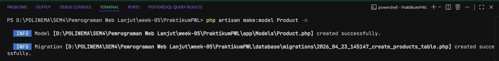
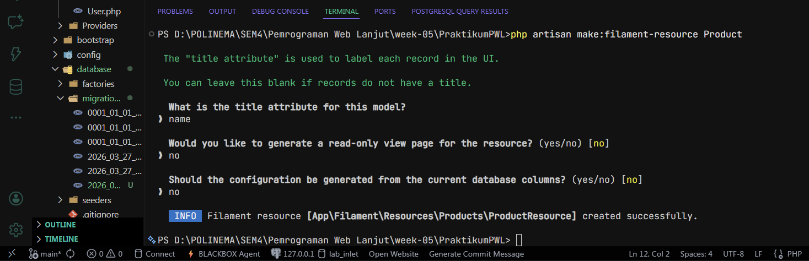
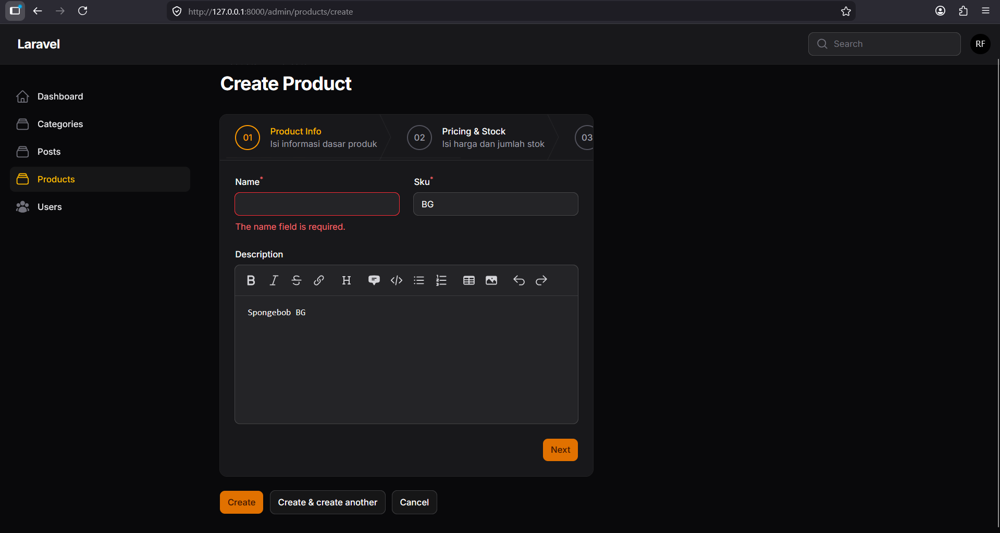
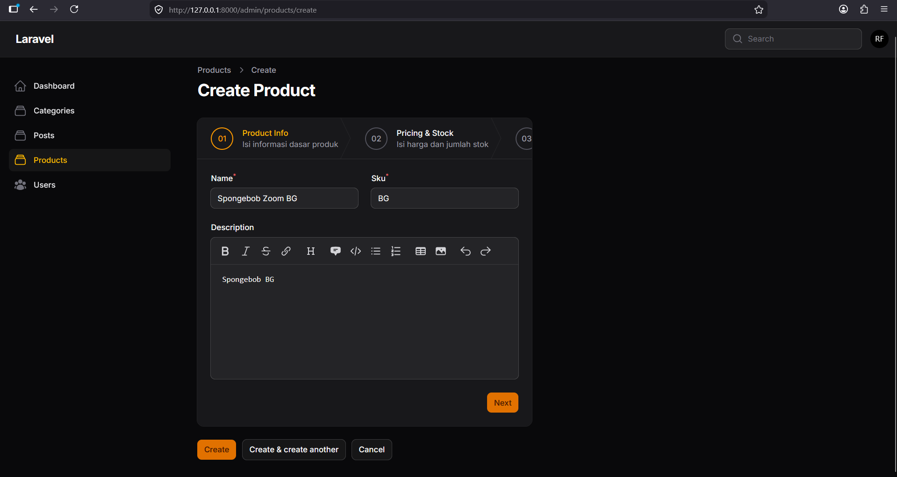
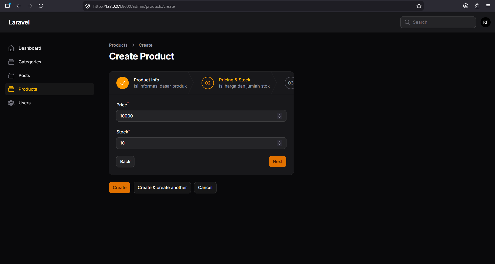
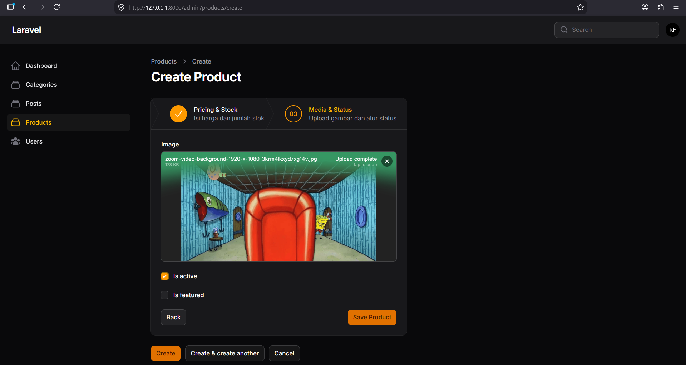
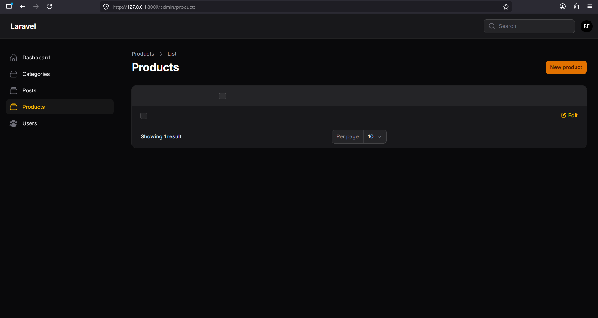

---

## **Laporan Praktikum: Pertemuan 8**

### **Implementasi Info List (View Page) di Filament**

### **1\. Langkah-langkah Penting**

- **Aktivasi View Page**: Memastikan Resource Product memiliki halaman View (bukan sekadar Edit).
- **Konfigurasi Info List**: Mengalihkan fungsi `form()` menjadi `infolist()` pada file `ProductResource.php` atau `ProductInfolist.php`.
- **Transformasi Komponen**: Mengganti komponen input menjadi entry display:
  - `TextInput` menjadi `TextEntry`.
  - `FileUpload` menjadi `ImageEntry`.
  - `Checkbox` menjadi `IconEntry`.
- **Styling Entry**: Menggunakan method `badge()` untuk SKU, `money('IDR')` untuk harga, dan `date()` untuk tanggal agar tampilan lebih informatif.

### **2\. Hasil Analisis**

- **Read-Only Display**: Info List memastikan data ditampilkan secara profesional tanpa resiko terubah secara tidak sengaja seperti pada form input.
- **Kustomisasi Visual**: Penggunaan badge dan warna memberikan penekanan visual pada status atau kategori tertentu.

### **3\. Jawaban Pertanyaan Analisis & Diskusi**

1. **Mengapa View Page tidak cocok menggunakan form input?** Karena fungsi utamanya adalah membaca data (read), bukan mengubah (write). Menggunakan form input pada halaman view bisa membingungkan user dan kurang estetik.
2. **Apa perbedaan TextColumn dan TextEntry?** `TextColumn` digunakan di halaman tabel (index), sedangkan `TextEntry` digunakan di halaman detail (view).
3. **Kapan kita menggunakan badge?** Saat ingin menonjolkan informasi singkat seperti status (Active/Inactive), SKU, atau kategori agar lebih mudah dipindai oleh mata.
4. **Apa keuntungan menggunakan IconEntry untuk boolean?** Lebih intuitif secara visual. Ikon centang hijau atau silang merah jauh lebih cepat dipahami dibanding teks "Yes" atau "No".

### **4\. Dokumentasi / Screenshot (Pertemuan 8)**

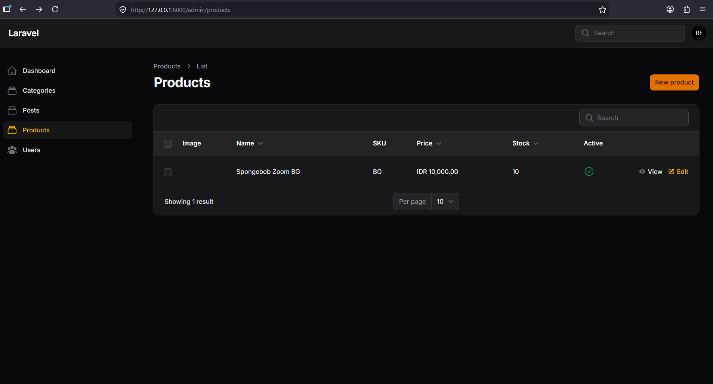

---

## **Laporan Praktikum: Pertemuan 9**

### **Implementasi Tabs pada Info List di Filament**

### **1\. Langkah-langkah Penting**

- **Implementasi Tabs**: Mengganti `Section` utama dengan komponen `Tabs::make()`.
- **Pengelompokan Tab**: Menyusun informasi ke dalam tab-tab yang relevan:
  - **Tab 1**: Product Info.
  - **Tab 2**: Pricing & Stock (ditambah `badge()` untuk stok).
  - **Tab 3**: Media & Status.
- **Penambahan Ikon**: Memberikan ikon berbeda pada tiap tab menggunakan `icon('heroicon-o-...')`.
- **Orientasi Vertical**: Mencoba method `vertical()` untuk mengubah posisi tab dari atas ke samping kiri.

### **2\. Hasil Analisis**

- **Navigasi Ringkas**: Tabs sangat efektif untuk data yang sangat detail, sehingga halaman tidak menjadi terlalu panjang ke bawah (long scroll).
- **Informasi Dinamis**: Penggunaan badge pada label tab memungkinkan admin melihat informasi penting (seperti jumlah stok) tanpa harus mengklik tab tersebut.

### **3\. Jawaban Pertanyaan Analisis & Diskusi**

1. **Kapan kita menggunakan Tabs dibanding Section?** Gunakan Tabs jika informasi sangat banyak dan terbagi dalam kategori yang berbeda secara tegas. Gunakan Section jika informasi masih cukup ditampilkan dalam satu halaman scroll.
2. **Apa kelebihan Tabs untuk data panjang?** Menghemat ruang layar dan memfokuskan perhatian pengguna pada satu kategori informasi dalam satu waktu.
3. **Apakah Tabs bisa digunakan pada Form juga?** Bisa. Filament menyediakan `Forms\Components\Tabs` yang cara kerjanya mirip dengan Info List Tabs.
4. **Bagaimana jika tab terlalu banyak?** Disarankan menggunakan orientasi `vertical()` atau mengevaluasi kembali apakah semua informasi tersebut memang perlu ditampilkan di satu halaman.

### **4\. Dokumentasi / Screenshot (Pertemuan 9)**

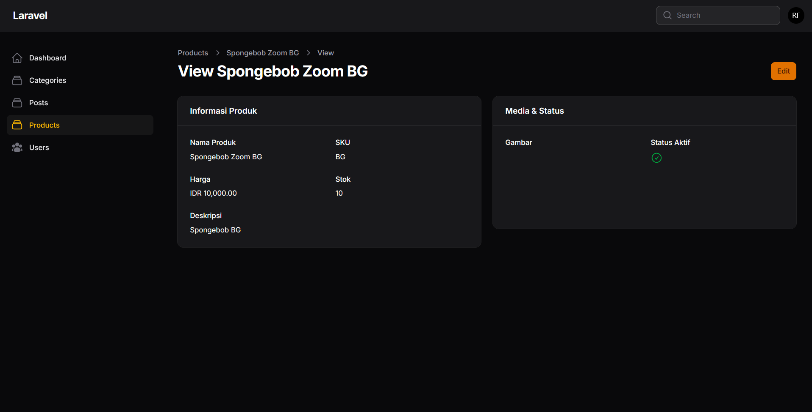
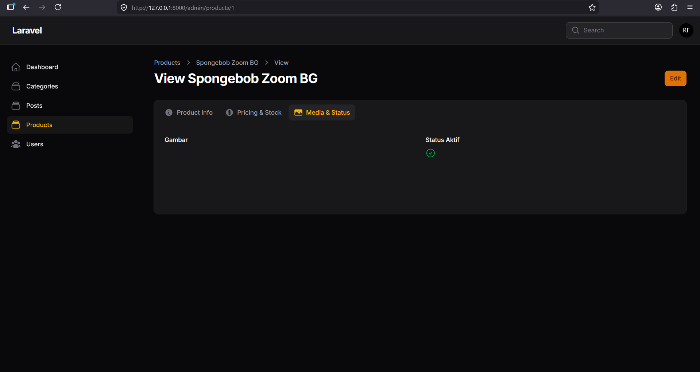
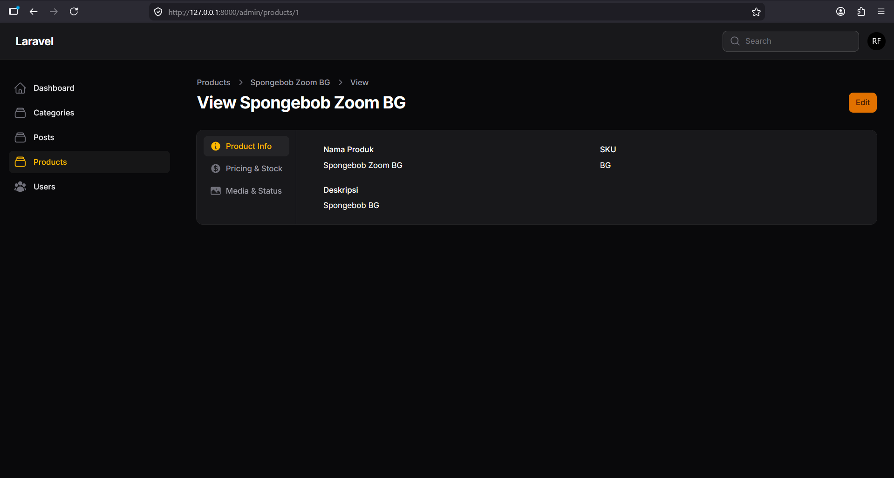
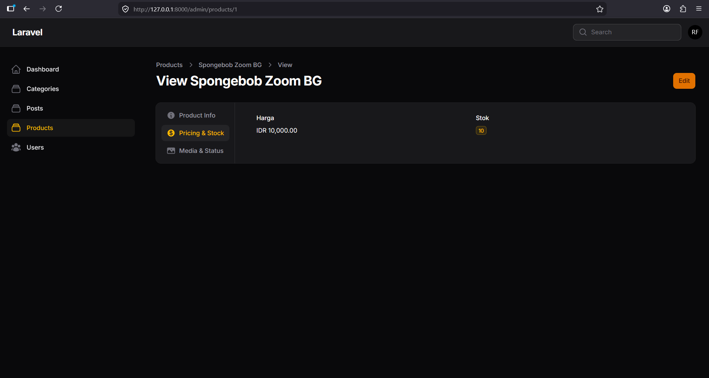
