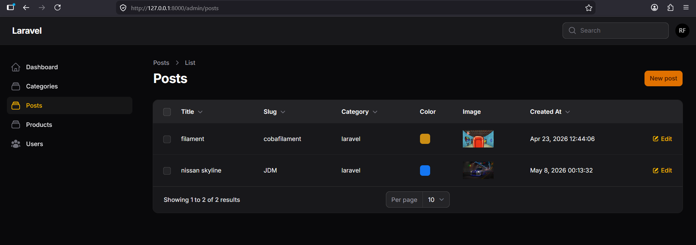
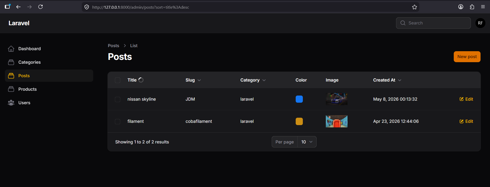
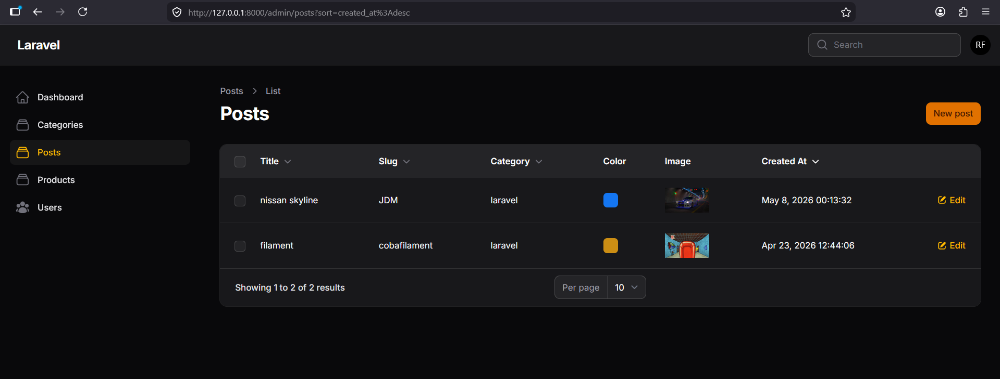
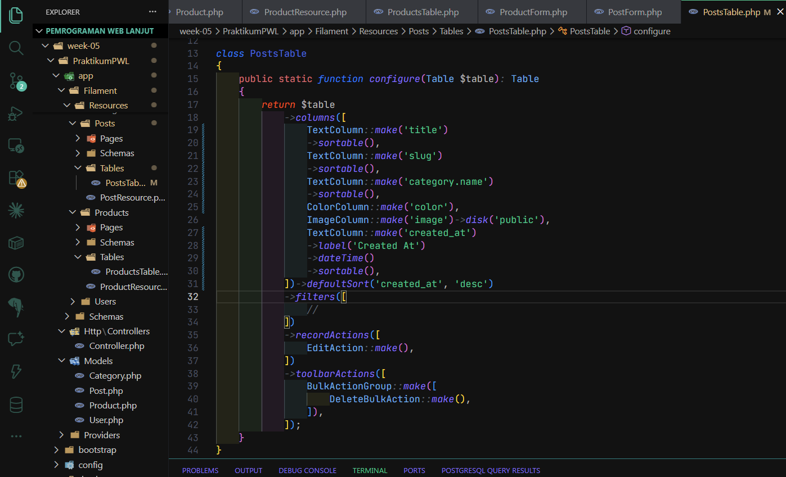

# Laporan Praktikum - Week 10 (Filament Sorting)

Nama : Rachmad Febriananda
NIM : 244107020095
Kelas : TI-2F

## A. Langkah Praktikum (Implementasi Sorting)

Berikut adalah langkah-langkah implementasi fitur sorting pada file `PostsTable.php`:

1. **Implementasi Sorting Kolom Title:** Menambahkan method `->sortable()` pada `TextColumn::make('title')`.
2. **Implementasi Sorting Kolom Slug:** Menambahkan method `->sortable()` pada `TextColumn::make('slug')`.
3. **Implementasi Sorting Kolom Category:** Menambahkan method `->sortable()` pada `TextColumn::make('category.name')`.
4. **Implementasi Sorting Kolom Tanggal:** Menambahkan method `->sortable()` pada `TextColumn::make('created_at')`.
5. **Mengatur Default Sorting:** Menambahkan method `->defaultSort('created_at', 'desc')` pada akhir definisi kolom di method `configure`, agar secara default tabel diurutkan berdasarkan data terbaru.

## B. Latihan Praktikum

1. **Aktifkan sorting pada semua kolom teks:** Semua text column ( itle, slug, category.name) di file PostsTable.php telah ditambahkan method ->sortable().
2. **Buat default sorting berdasarkan Created At ascending:** Pada file PostsTable.php, konfigurasi table telah ditambahkan ->defaultSort('created_at', 'desc').
3. **Uji sorting ascending dan descending:** Fitur sorting telah berhasil dijalankan pada grid di Filament panel.
4. **Screenshot:**
   - Sorting Title Asc
     
   - Sorting Title Desc
     
   - Sorting Date Desc
     
   - Screenshot Kode
     

## C. Analisis & Diskusi

1. **Mengapa sorting penting pada admin panel?**
   Sorting sangat penting karena admin panel sering kali menampilkan jumlah data yang besar. Dengan sorting, admin dapat dengan cepat menemukan, menyusun, dan mengorganisasi data berdasarkan kriteria tertentu (seperti waktu pembuatan terbaru, urutan abjad, dll), sehingga meningkatkan efisiensi dan user experience.

2. **Apa perbedaan sortable biasa dengan defaultSort()?**
   - sortable(): Menambahkan tombol/fitur sort pada header kolom di tabel antarmuka Filament, memungkinkan user untuk menyortir data secara manual (dapat dibulak-balik ASC/DESC saat tabel sudah dimuat/diklik).
   - defaultSort(): Menentukan pengurutan data bawaan (secara default) semenjak halaman pertama kali dimuat. User akan melihat data sudah diurutkan berdasarkan kolom dan arah yang didefinisikan pada fungsi ini (misal: 'created_at', 'desc').

3. **Mengapa relasi tetap bisa di-sort?**
   Filament (dan Eloquent pada Laravel) pintar dalam melacak kueri. Saat kita melakukan sorting berdasarkan relasi (misalnya category.name), Filament akan secara otomatis menambahkan klausa ORDER BY berdasarkan join atau sub-query ke tabel relasi di database, sehingga field eksternal tersebut pun dapat disortir langsung layaknya field internal.

4. **Kapan kita menggunakan desc sebagai default?**
   Sangat umum menggunakan desc (descending) sebagai default untuk kolom tanggal/waktu (seperti created_at atau updated_at). Tujuannya adalah agar user atau admin dapat langsung melihat data (post, transaksi, atau log) yang paling baru atau terakhir dibuat berada di urutan teratas dari tabel.
